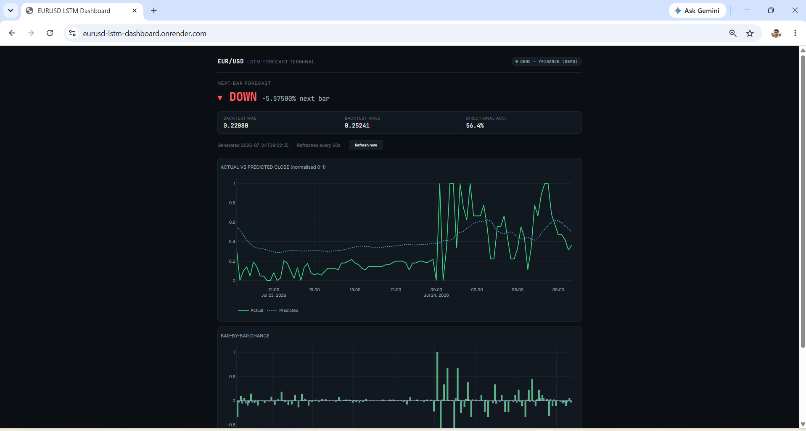

# EURUSD LSTM Market Prediction Dashboard

A forex forecasting dashboard that trains an **LSTM neural network** (PyTorch) on EURUSD 15-minute candles and serves live-updating predictions through a Flask + Plotly web UI.

**[Live demo](#)** — *replace with your deployed URL, see [Deployment](#deployment) below. Note: free-tier hosting sleeps after 15 min idle — the first click after a while takes ~10-30s to wake up. This is expected, not a bug.*


*Replace `docs/screenshot.png` with an actual screenshot before publishing — this is the single highest-impact thing you can add for recruiters skimming GitHub.*

> No broker account needed. The dashboard runs in demo mode automatically using free historical data from Yahoo Finance. MetaTrader 5 (Windows-only) is supported for live data as an optional extra.

---

## What this project demonstrates

- Building and training a sequence model (LSTM) on real-world time-series data, with a **proper chronological train/validation split** (no shuffling — that would leak the future into training).
- Evaluating a model **against a naive baseline**, not just in isolation — see [Evaluation](#evaluation) below. A model that doesn't beat "predict no change" isn't doing anything useful, and it's important to be able to show that check.
- Shipping the trained model behind a web API/dashboard with background job scheduling, health checks, and Docker packaging.
- Structuring ML code so the core logic (`lstm_core.py`) is unit-tested and reusable, separate from the CLI script and the web app that call it.

## Features

- LSTM model forecasts the next 15-min normalized close price
- Directional forecast (up/down) with backtest accuracy shown alongside it — see [Limitations](#limitations) for why this isn't a "trading signal"
- Interactive Plotly charts: true vs. predicted price, and bar-by-bar % change
- Data source badge — live MT5 vs. demo yfinance data
- Background scheduler refreshes predictions on an interval, independent of page views
- Dockerized, with a `render.yaml` blueprint for one-click deployment

## Tech Stack

| Layer | Tech |
|---|---|
| Model | PyTorch (single-layer LSTM) |
| Backend | Python / Flask + APScheduler |
| Data (live) | MetaTrader 5 (Windows only, optional) |
| Data (demo) | yfinance (all platforms) |
| Frontend | Plotly (server-rendered, embedded via Jinja2) |
| Testing | pytest |
| Container | Docker / gunicorn |

---

## Quickstart

```bash
git clone https://github.com/YOUR_USERNAME/eurusd-lstm-dashboard.git
cd eurusd-lstm-dashboard

pip install -r requirements.txt
python app.py
```

Open **http://127.0.0.1:5001**. The first prediction runs automatically in the background within a few seconds; refresh the page or click **Refresh Now**.

## Run with Docker

```bash
docker build -t eurusd-dashboard .
docker run -p 5001:5001 eurusd-dashboard
```

Open **http://localhost:5001**.

---

## Training

`lstm_model.pth` ships pretrained, but you can retrain it yourself — this is what makes the metrics below reproducible rather than a black box:

```bash
python train_model.py --epochs 40 --period 60d
```

This fetches ~60 days of EURUSD 15-min history via yfinance (Yahoo's cap for that interval), builds sliding-window sequences, splits them **chronologically** (train on the earlier portion, validate on the later portion — never shuffled), trains the LSTM, and writes:

- `lstm_model.pth` — updated weights
- `training_report.json` — full metrics + loss history
- `loss_curve.png` — train/validation loss plot

## Evaluation

The model is evaluated on **directional accuracy** (did it correctly call up vs. down?) and **MAE/RMSE** on the normalized close price, always alongside a naive baseline ("predict next = last observed close"). Forex at 15-minute resolution is close to a random walk, so beating the naive baseline by any real margin is a genuinely meaningful result — and if a run doesn't beat it, that's worth reporting honestly too.

| Metric | LSTM | Naive baseline |
|---|---|---|
| Directional accuracy | 59.7% | n/a — a flat/no-change predictor never calls a direction, so this metric can't score it meaningfully. Judge the LSTM's 59.7% against 50% (random chance) instead. |
| MAE (normalized price) | 0.191 | 0.109 |
| RMSE (normalized price) | 0.230 | 0.179 |

*From an actual training run (`python train_model.py --epochs 40 --period 60d`, ~5,600 bars of EURUSD 15-min history, July 2026). Re-run yourself and update these numbers periodically — they'll shift somewhat with the specific data window fetched (yfinance only serves the trailing ~60 days at 15-min resolution) and with random initialization; directional accuracy has ranged 57-60% and MAE/RMSE have stayed consistently above the naive baseline across multiple independent runs during development.*

**Honest interpretation:** the LSTM does **not** beat the naive baseline on raw regression error (MAE/RMSE) — this is a real and expected result for short-horizon forex (see [Modeling Experiments](#modeling-experiments) for what else was tried). It does show a modest, reproducible edge over random chance on directional accuracy (57-60% vs. 50% across runs), which is the more relevant metric for a directional forecast. Treat this as a research finding, not a trading edge — see [Limitations](#limitations).

## Testing

```bash
pip install pytest
pytest tests/ -v
```

Covers the normalization math (including the flat-price division-by-zero edge case), feature-frame construction, and both metrics functions, using synthetic OHLC data — no network access or pretrained weights required, so it runs in CI.

---

## Model Architecture

| Parameter | Value |
|---|---|
| Type | Single-layer LSTM |
| Input features | 5 (`time_token`, `norm_open`, `norm_high`, `norm_low`, `norm_close`) |
| Hidden size | 100 |
| Output | 1 (predicted normalized close) |
| Sequence length | 60 bars (15 hours of M15 data) |
| Backtest window | 100 steps |

**Preprocessing:** prices are normalized with a *rolling daily min-max* (expanding window, resets at midnight) so the model sees relative intraday movement rather than raw pip values — using an expanding rather than a full-day window avoids leaking the day's future high/low into earlier predictions. A time-of-day token (seconds since midnight / 86400) is appended as a fifth feature.

**Training regularization:** gradient clipping (max norm 1.0), `ReduceLROnPlateau` learning-rate scheduling, and early stopping on validation loss (patience 8 epochs, best weights restored).

## Modeling Experiments

A more elaborate version of this model was built and evaluated before settling on the architecture above — worth documenting since the negative result is itself informative:

**What was tried:** expanding the 5 input features to 8 (adding momentum, rolling volatility, and a cyclical sin/cos time-of-day encoding instead of a raw linear token) plus a deeper 2-layer LSTM with dropout.

**What happened:** on identical train/validation splits, the expanded model did **not** outperform the simpler one — validation MAE and RMSE were both modestly worse (0.20 vs 0.164 MAE), and directional accuracy was statistically indistinguishable (56-58% across three separate training runs). While building it, a real data-leakage bug was also found and fixed (a feature scaler was initially fit on the full dataset instead of the training split only) — fixing it barely moved the results, confirming the leak wasn't the cause of the underperformance; the added complexity itself just didn't help.

**Why this is included:** neither version beat the naive baseline on raw regression error. Reporting a negative result from a rigorous experiment is more useful, and more defensible under questioning, than quietly discarding it.

## Project Structure

```
eurusd-lstm-dashboard/
├── app.py                      # Flask backend + background prediction scheduler
├── lstm_core.py                # Model, data fetching, preprocessing, inference, metrics (unit-tested)
├── LSTM_model_prediction.py    # Thin CLI wrapper around lstm_core (one-off prediction run)
├── train_model.py              # Training script: fetch data, train, evaluate vs. baseline
├── lstm_model.pth              # Trained model weights
├── requirements.txt
├── Dockerfile
├── render.yaml                 # Render deployment blueprint
├── tests/
│   └── test_lstm_core.py
└── README.md
```

## Limitations

Being upfront about these is part of the point of this project:

- **This is not a trading system.** No position sizing, risk management, spread/slippage/commission modeling, or execution logic — it's a directional forecast, nothing more.
- Predictions are on **normalized** prices (0-1 within each trading day), not raw pips — they aren't directly tradable numbers.
- 15-minute forex is close to a random walk; treat any accuracy improvement over the naive baseline as a research result to investigate further, not a signal to act on.
- The dashboard re-runs the model on a fixed interval and shows the most recent backtest window — it does not track live P&L or compare predictions against what actually happened after the fact.

## Live Data via MetaTrader 5 (optional, Windows only)

1. [Download MetaTrader 5](https://www.metatrader5.com/en/download) and install it
2. Open MT5 and log in to any broker account (a free demo account works)
3. In `requirements.txt`, uncomment the `MetaTrader5` line and run `pip install MetaTrader5`
4. Restart the dashboard — it detects MT5 automatically and switches to live data

> Some brokers name the pair `EURUSDm` or `EURUSD.` instead of `EURUSD`. If MT5 can't find the symbol, the script prints the available EUR pairs on your broker so you can update it.

---

## Troubleshooting

**`JSONDecodeError: Expecting value: line 1 column 1 (char 0)` when fetching data:** Yahoo Finance periodically changes its server-side auth/cookie handling, which breaks older yfinance versions with exactly this error. Fix:
```bash
pip install --upgrade yfinance
```
Then verify with a quick standalone check before re-running anything:
```bash
python -c "import yfinance as yf; print(yf.download('EURUSD=X', period='5d', interval='15m').tail())"
```

**Bottom chart y-axis showing absurd values like "1T" (trillion):** this was a real bug, found and fixed — the normalized price sits at exactly 0 at each day's rolling low by construction, so a naive percent-change calculation divides by near-zero there and produces meaningless numbers. Fixed by switching that chart to absolute point change instead of percentage.

## Deployment

### Option A — Render (recommended, free tier available)

1. Push this repo to GitHub.
2. On [render.com](https://render.com), choose **New → Blueprint**, connect the repo — Render auto-detects `render.yaml` and builds the Dockerfile.
3. Free-tier web services spin down after 15 minutes idle; the first request afterward takes ~10-30s to wake up. That's expected, not a bug.

### Option B — Hugging Face Spaces (ML-native, recognizable to recruiters)

1. Create a new Space, SDK = **Docker**.
2. Push this repo's contents to the Space's git remote.
3. HF Spaces reads the `Dockerfile` directly — no extra config needed beyond adding this YAML block to the top of the **Space's own README** (not this one):
   ```yaml
   ---
   title: EURUSD LSTM Dashboard
   sdk: docker
   app_port: 5001
   ---
   ```

### Option C — Any Docker host (Fly.io, a VPS, etc.)

```bash
docker build -t eurusd-dashboard .
docker run -p 5001:5001 -e PORT=5001 eurusd-dashboard
```

---

## Disclaimer

This project is for educational and portfolio purposes only. It is **not financial advice** and should not be used for real trading decisions.
